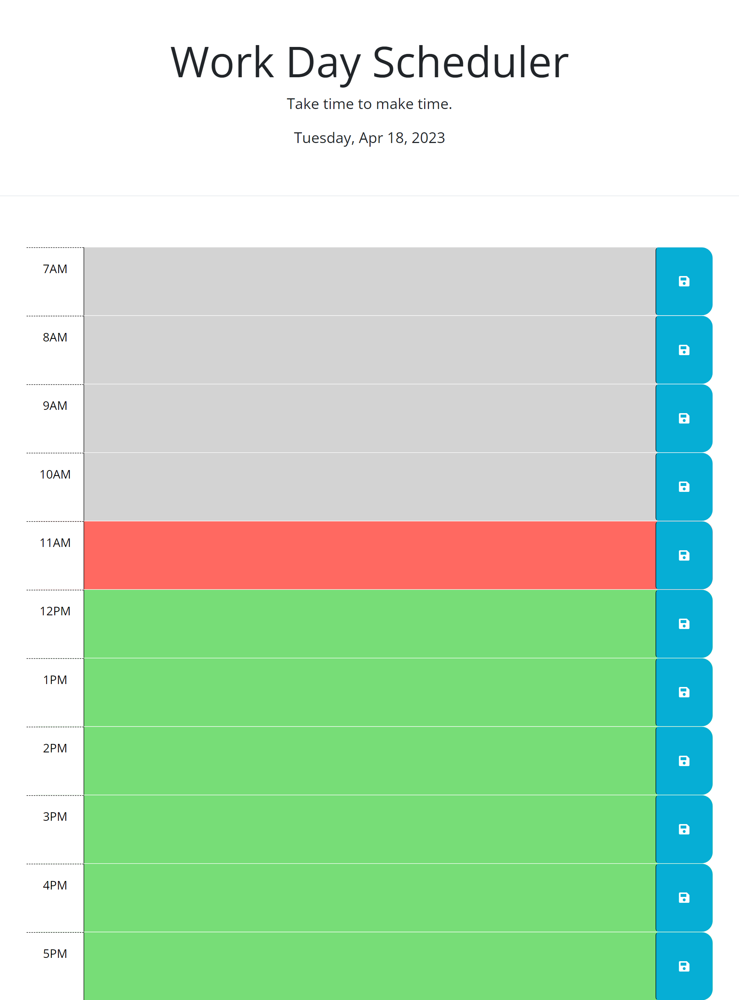

# work-day-scheduler

## Description
A simple tool made to allow users to schedule their work day using javascript elements.

## Links

- [Live](https://cailenh.github.io/work-day-scheduler/)

## Screenshots

## Available Commands

N/A

## Built With

- HTML
- CSS
- JavaScript

## Future Updates

- N/A

## Author

Cailen Hamm

- [Email](mailto:cailenhamm@gmail.com)

